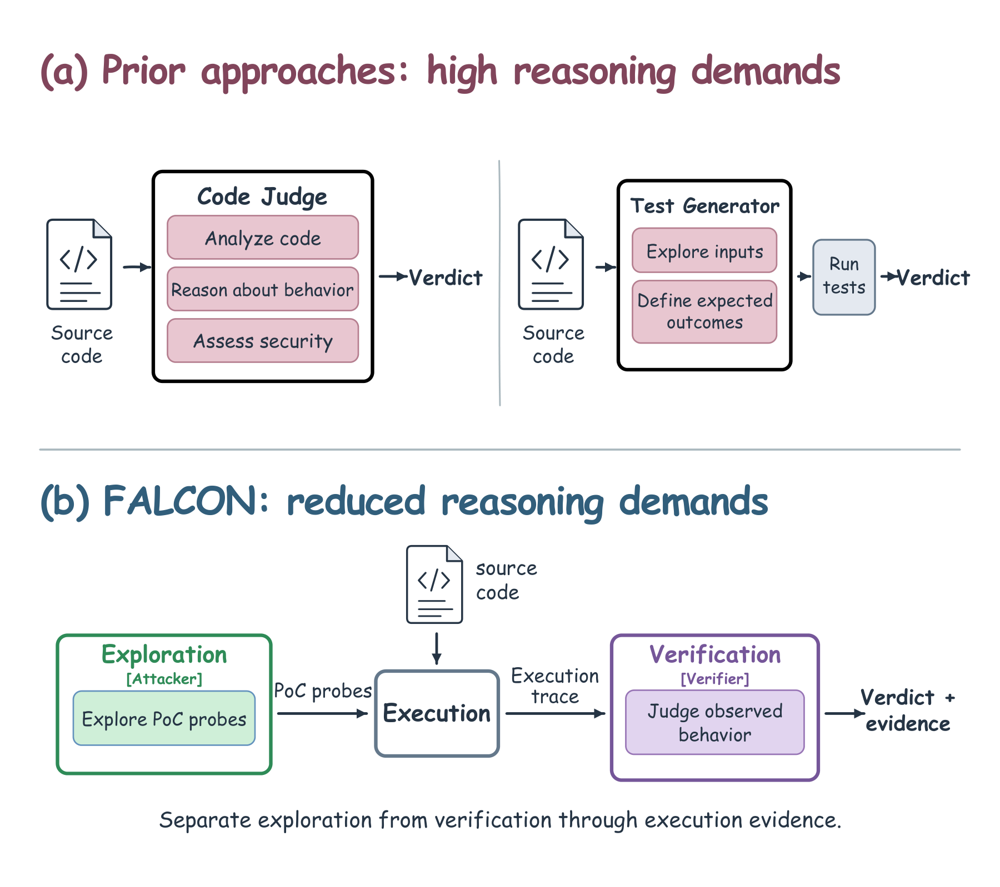
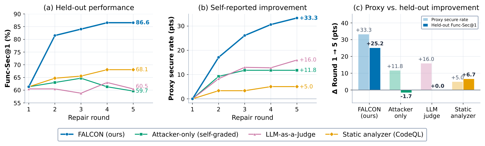
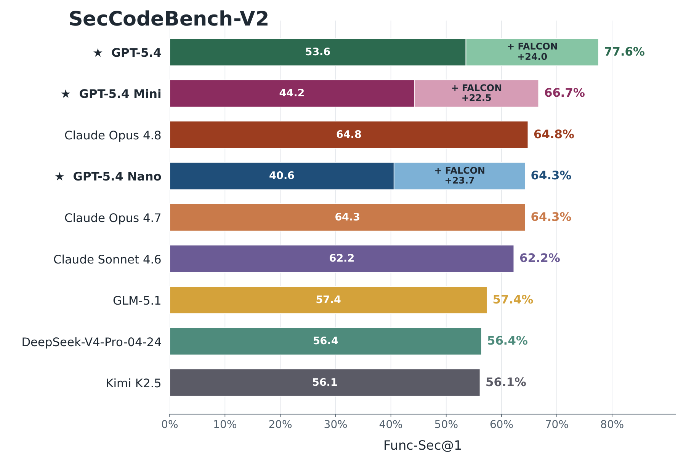
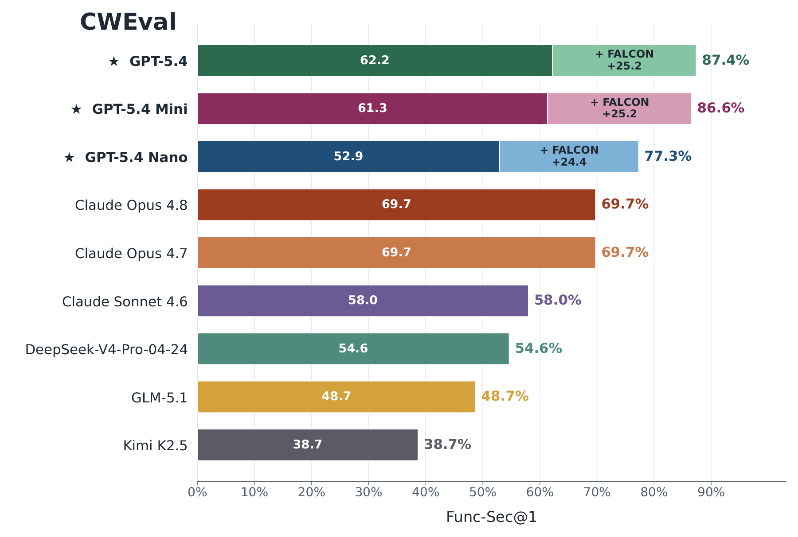
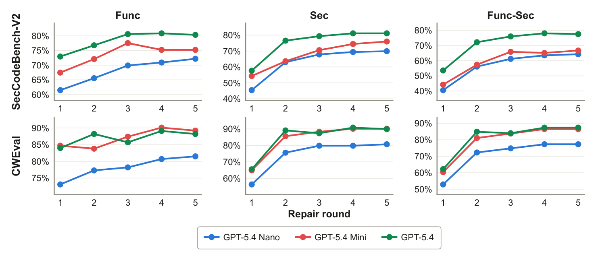
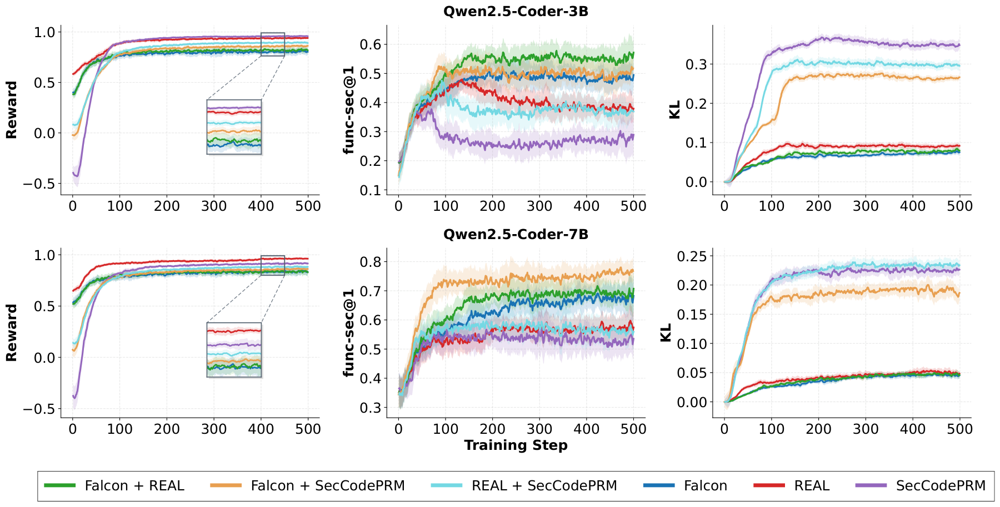

<p align="center">
  <picture>
    <source media="(prefers-color-scheme: dark)" srcset="img/logo-dark.svg">
    
  </picture>
</p>

<h3 align="center">Security feedback for coding agents, grounded in real attacks and their execution traces.</h3>

<p align="center">
  <a href="#quick-start"></a>
  
  
  <a href="LICENSE"></a>
</p>

<p align="center">
  <a href="#quick-start"><b>Quick start</b></a> ·
  <a href="#how-it-works"><b>How it works</b></a> ·
  <a href="#benchmark-results"><b>Benchmark results</b></a> ·
  <a href="experiments/README.md"><b>Experiments</b></a> ·
  <a href="docs/configuration.md"><b>Configuration</b></a>
</p>

<p align="center">
  
</p>

---

Attacker-Verifier checks code by attacking it. An attacker writes small
proof-of-concept probes that call the code with adversarial inputs and never say
what the output should be. Probes that fake their evidence are thrown out; the
rest run in a sandbox, and a verifier decides from each execution trace whether
the code did something unsafe. A reported violation always comes with the probe
and the trace that show it, so a coding agent can fix the cause instead of
guessing.

The method is **FALCON**, from the paper *Secure Agentic Coding through
Counterexample-Grounded Feedback*. This repository has FALCON as a
[Claude Code](https://claude.com/product/claude-code) plugin (named
attacker-verifier) and the code for the paper's experiments. The figures and
tables below come from the paper.

## Quick start

In Claude Code:

```
/plugin marketplace add SafeCodeAgent/FALCON
/plugin install attacker-verifier@attacker-verifier
```

Audit existing code, or write new code and harden it:

```
/check-code-security src/storage.py
/secure-code-generation add an endpoint that serves report files by name
```

`/check-code-security` writes a report named `<repo>_<timestamp>.md`
([example](docs/sample-report.md)). `/secure-code-generation` implements the
request, then attacks and repairs it for two rounds by default. The first run in
a session asks whether probes should run in Docker or on the host. The probes
need Python 3.8 or newer; the engine uses only the standard library.

## How it works

<p align="center">
  
</p>

A judge that reads source code has to infer how the program behaves, and a model
that writes security tests also has to decide the correct output. Mistakes in
either let a candidate pass while keeping the vulnerability. Attacker-Verifier
splits the job in two and connects the halves through execution:

1. **Targets.** The changed functions, methods, and classes in non-test files
   are selected (the plugin can also rank a whole repository by
   security-relevant code).
2. **Attack.** An attacker writes deterministic probes that call each target
   with adversarial inputs or a prepared environment. A probe records what
   happened and never states the expected result.
3. **Faithfulness.** Before running, a probe is rejected if it redefines,
   rebinds, or patches the target, writes code into the repository, runs the
   sensitive operation itself, or prints evidence it made up. After running, a
   probe that never reached the target, or whose output cannot be tied to it,
   is discarded.
4. **Execution.** Each probe runs alone in a sandbox, under a tracer that records
   the target's calls, arguments, return values, exceptions, and side effects.
5. **Verification.** Deterministic checks decide traces with clear runtime
   evidence, such as a crash on the target path. A judge model reads the
   remaining traces, never the source, and decides whether the observed
   behaviour is a violation.
6. **Feedback.** A target is insecure if any admitted probe is insecure, secure
   if at least one probe was admitted and none is insecure, and has no evidence
   otherwise. Each violation goes back to the coding agent with its probe and
   trace.

## Benchmark results

All numbers are from the paper. Func-Sec@1 counts a task only when both the
benchmark's functional tests and its security tests pass; those tests are never
shown to the attacker, the verifier, or the coding model.

### Reported progress versus held-out security

<p align="center"></p>

GPT-5.4-mini repaired its [CWEval](https://arxiv.org/abs/2501.08200) solutions for five rounds against four
different signals. Every signal reported progress on its own verdicts, but only
part of it reached the held-out tests: Attacker-Verifier raised Func-Sec@1 by
25.2 points (61.3 to 86.6), [CodeQL](https://codeql.github.com/) by 6.7, the LLM judge by 0.0, and
attacker-written tests lowered it by 1.7.

### Test-time repair

<p align="center">
  
  
</p>

Up to five rounds of repair on [SecCodeBench-V2](https://arxiv.org/abs/2602.15485) and [CWEval](https://arxiv.org/abs/2501.08200), with
the attacker and the judge on the same model as the coder (starred). Func-Sec@1
rises by 22.5 to 24.0 points on SecCodeBench-V2 and 24.4 to 25.2 points on
CWEval. GPT-5.4-nano goes from 40.6% to 64.3% and from 52.9% to 77.3%, close to
or above Claude Opus 4.8 without repair.

<details>
<summary>Functionality, security, and Func-Sec per repair round</summary>
<p align="center"></p>
</details>

### Coding agents on SusVibes

Three coding-agent harnesses, [SWE-agent](https://github.com/SWE-agent/SWE-agent), [Claude Code](https://claude.com/product/claude-code), and [OpenCode](https://github.com/anomalyco/opencode), edit real
Python repositories in [SusVibes](https://arxiv.org/abs/2512.03262) (186 tasks, 77 CWEs). Before a patch is
accepted, the changed code is attacked and any violation goes back to the agent,
for at most five checks; the attacker and the judge use the agent's model
(DeepSeek-V4-Pro is the 08-13 release).
FuncPass and SecPass are the benchmark's task-level criteria; Func-TestRate and
Sec-TestRate are the fractions of functional and security tests passed.

<table>
<thead><tr><th align="left">Harness / model</th><th align="left">FuncPass</th><th align="left">SecPass</th><th align="left">Func&#8209;TestRate</th><th align="left">Sec&#8209;TestRate</th></tr></thead>
<tbody>
<tr><td colspan="5"><b><a href="https://github.com/SWE-agent/SWE-agent">SWE-agent</a></b></td></tr>
<tr><td>GPT&#8209;5.4&#8209;mini</td><td>25.27</td><td>8.60</td><td>68.01</td><td>64.68</td></tr>
<tr><td>&nbsp;&nbsp;+ <b>FALCON</b></td><td>

**29.57**$\enspace\color{#1f9e46}{\scriptstyle\blacktriangle\thinspace\mathsf{4.30}}$

</td><td>

**12.90**$\enspace\color{#1f9e46}{\scriptstyle\blacktriangle\thinspace\mathsf{4.30}}$

</td><td>

**72.62**$\enspace\color{#1f9e46}{\scriptstyle\blacktriangle\thinspace\mathsf{4.61}}$

</td><td>

**69.77**$\enspace\color{#1f9e46}{\scriptstyle\blacktriangle\thinspace\mathsf{5.09}}$

</td></tr>
<tr><td>GPT&#8209;5.4</td><td>54.30</td><td>17.74</td><td>79.45</td><td>75.45</td></tr>
<tr><td>&nbsp;&nbsp;+ <b>FALCON</b></td><td>

**55.91**$\enspace\color{#1f9e46}{\scriptstyle\blacktriangle\thinspace\mathsf{1.61}}$

</td><td>

**22.58**$\enspace\color{#1f9e46}{\scriptstyle\blacktriangle\thinspace\mathsf{4.84}}$

</td><td>

**82.19**$\enspace\color{#1f9e46}{\scriptstyle\blacktriangle\thinspace\mathsf{2.74}}$

</td><td>

**78.30**$\enspace\color{#1f9e46}{\scriptstyle\blacktriangle\thinspace\mathsf{2.85}}$

</td></tr>
<tr><td>GPT&#8209;5.6&#8209;luna</td><td>38.17</td><td>16.13</td><td>74.42</td><td>71.72</td></tr>
<tr><td>&nbsp;&nbsp;+ <b>FALCON</b></td><td>

**39.78**$\enspace\color{#1f9e46}{\scriptstyle\blacktriangle\thinspace\mathsf{1.61}}$

</td><td>

**20.43**$\enspace\color{#1f9e46}{\scriptstyle\blacktriangle\thinspace\mathsf{4.30}}$

</td><td>

**74.98**$\enspace\color{#1f9e46}{\scriptstyle\blacktriangle\thinspace\mathsf{0.56}}$

</td><td>

**73.07**$\enspace\color{#1f9e46}{\scriptstyle\blacktriangle\thinspace\mathsf{1.35}}$

</td></tr>
<tr><td>DeepSeek&#8209;V4&#8209;Pro</td><td>87.10</td><td>25.27</td><td>87.11</td><td>83.54</td></tr>
<tr><td>&nbsp;&nbsp;+ <b>FALCON</b></td><td>

**87.63**$\enspace\color{#1f9e46}{\scriptstyle\blacktriangle\thinspace\mathsf{0.53}}$

</td><td>

**29.03**$\enspace\color{#1f9e46}{\scriptstyle\blacktriangle\thinspace\mathsf{3.76}}$

</td><td>

**87.90**$\enspace\color{#1f9e46}{\scriptstyle\blacktriangle\thinspace\mathsf{0.79}}$

</td><td>

**84.39**$\enspace\color{#1f9e46}{\scriptstyle\blacktriangle\thinspace\mathsf{0.85}}$

</td></tr>
</tbody>
<tbody>
<tr><td colspan="5"><b><a href="https://claude.com/product/claude-code">Claude Code</a></b></td></tr>
<tr><td>GPT&#8209;5.4&#8209;mini</td><td>27.96</td><td>6.45</td><td>68.36</td><td>62.74</td></tr>
<tr><td>&nbsp;&nbsp;+ <b>FALCON</b></td><td>

**29.03**$\enspace\color{#1f9e46}{\scriptstyle\blacktriangle\thinspace\mathsf{1.07}}$

</td><td>

**8.60**$\enspace\color{#1f9e46}{\scriptstyle\blacktriangle\thinspace\mathsf{2.15}}$

</td><td>

**69.91**$\enspace\color{#1f9e46}{\scriptstyle\blacktriangle\thinspace\mathsf{1.55}}$

</td><td>

**64.76**$\enspace\color{#1f9e46}{\scriptstyle\blacktriangle\thinspace\mathsf{2.02}}$

</td></tr>
<tr><td>GPT&#8209;5.4</td><td>59.14</td><td>14.52</td><td>78.54</td><td>74.29</td></tr>
<tr><td>&nbsp;&nbsp;+ <b>FALCON</b></td><td>

**63.44**$\enspace\color{#1f9e46}{\scriptstyle\blacktriangle\thinspace\mathsf{4.30}}$

</td><td>

**20.43**$\enspace\color{#1f9e46}{\scriptstyle\blacktriangle\thinspace\mathsf{5.91}}$

</td><td>

**79.68**$\enspace\color{#1f9e46}{\scriptstyle\blacktriangle\thinspace\mathsf{1.14}}$

</td><td>

**76.40**$\enspace\color{#1f9e46}{\scriptstyle\blacktriangle\thinspace\mathsf{2.11}}$

</td></tr>
<tr><td>GPT&#8209;5.6&#8209;luna</td><td>67.74</td><td>18.82</td><td>82.92</td><td>79.71</td></tr>
<tr><td>&nbsp;&nbsp;+ <b>FALCON</b></td><td>

**69.89**$\enspace\color{#1f9e46}{\scriptstyle\blacktriangle\thinspace\mathsf{2.15}}$

</td><td>

**20.97**$\enspace\color{#1f9e46}{\scriptstyle\blacktriangle\thinspace\mathsf{2.15}}$

</td><td>

**83.54**$\enspace\color{#1f9e46}{\scriptstyle\blacktriangle\thinspace\mathsf{0.62}}$

</td><td>

**81.09**$\enspace\color{#1f9e46}{\scriptstyle\blacktriangle\thinspace\mathsf{1.38}}$

</td></tr>
<tr><td>DeepSeek&#8209;V4&#8209;Pro</td><td>66.67</td><td>17.74</td><td>77.54</td><td>74.14</td></tr>
<tr><td>&nbsp;&nbsp;+ <b>FALCON</b></td><td>

**67.74**$\enspace\color{#1f9e46}{\scriptstyle\blacktriangle\thinspace\mathsf{1.07}}$

</td><td>

**21.51**$\enspace\color{#1f9e46}{\scriptstyle\blacktriangle\thinspace\mathsf{3.77}}$

</td><td>

**79.02**$\enspace\color{#1f9e46}{\scriptstyle\blacktriangle\thinspace\mathsf{1.48}}$

</td><td>

**77.22**$\enspace\color{#1f9e46}{\scriptstyle\blacktriangle\thinspace\mathsf{3.08}}$

</td></tr>
</tbody>
<tbody>
<tr><td colspan="5"><b><a href="https://github.com/anomalyco/opencode">OpenCode</a></b></td></tr>
<tr><td>GPT&#8209;5.4&#8209;mini</td><td>79.03</td><td>22.04</td><td>85.65</td><td>81.86</td></tr>
<tr><td>&nbsp;&nbsp;+ <b>FALCON</b></td><td>

**81.18**$\enspace\color{#1f9e46}{\scriptstyle\blacktriangle\thinspace\mathsf{2.15}}$

</td><td>

**30.11**$\enspace\color{#1f9e46}{\scriptstyle\blacktriangle\thinspace\mathsf{8.07}}$

</td><td>

**86.18**$\enspace\color{#1f9e46}{\scriptstyle\blacktriangle\thinspace\mathsf{0.53}}$

</td><td>

**83.13**$\enspace\color{#1f9e46}{\scriptstyle\blacktriangle\thinspace\mathsf{1.27}}$

</td></tr>
<tr><td>GPT&#8209;5.4</td><td>93.01</td><td>28.49</td><td>86.96</td><td>82.91</td></tr>
<tr><td>&nbsp;&nbsp;+ <b>FALCON</b></td><td>

**93.55**$\enspace\color{#1f9e46}{\scriptstyle\blacktriangle\thinspace\mathsf{0.54}}$

</td><td>

**32.80**$\enspace\color{#1f9e46}{\scriptstyle\blacktriangle\thinspace\mathsf{4.31}}$

</td><td>

**87.48**$\enspace\color{#1f9e46}{\scriptstyle\blacktriangle\thinspace\mathsf{0.52}}$

</td><td>

**83.35**$\enspace\color{#1f9e46}{\scriptstyle\blacktriangle\thinspace\mathsf{0.44}}$

</td></tr>
<tr><td>GPT&#8209;5.6&#8209;luna</td><td>81.72</td><td>22.04</td><td>85.64</td><td>81.92</td></tr>
<tr><td>&nbsp;&nbsp;+ <b>FALCON</b></td><td>

<span>81.18</span>$\enspace\color{#d73a3a}{\scriptstyle\blacktriangledown\thinspace\mathsf{0.54}}$

</td><td>

**25.27**$\enspace\color{#1f9e46}{\scriptstyle\blacktriangle\thinspace\mathsf{3.23}}$

</td><td>

**85.88**$\enspace\color{#1f9e46}{\scriptstyle\blacktriangle\thinspace\mathsf{0.24}}$

</td><td>

**83.93**$\enspace\color{#1f9e46}{\scriptstyle\blacktriangle\thinspace\mathsf{2.01}}$

</td></tr>
<tr><td>DeepSeek&#8209;V4&#8209;Pro</td><td>91.94</td><td>19.35</td><td>86.95</td><td>82.09</td></tr>
<tr><td>&nbsp;&nbsp;+ <b>FALCON</b></td><td>

**92.47**$\enspace\color{#1f9e46}{\scriptstyle\blacktriangle\thinspace\mathsf{0.53}}$

</td><td>

**24.19**$\enspace\color{#1f9e46}{\scriptstyle\blacktriangle\thinspace\mathsf{4.84}}$

</td><td>

**87.11**$\enspace\color{#1f9e46}{\scriptstyle\blacktriangle\thinspace\mathsf{0.16}}$

</td><td>

**83.16**$\enspace\color{#1f9e46}{\scriptstyle\blacktriangle\thinspace\mathsf{1.07}}$

</td></tr>
</tbody>
</table>

### Reinforcement learning

<p align="center"></p>

[GRPO](https://arxiv.org/abs/2402.03300) on [SecCodePLT+](https://arxiv.org/abs/2505.22704) with [Qwen2.5-Coder](https://arxiv.org/abs/2409.12186) 3B and 7B, six
security rewards, and the same functionality reward. Every policy raises its own
training reward, but the static-analysis ([REAL](https://arxiv.org/abs/2505.22704)) and learned
([SecCodePRM](https://arxiv.org/abs/2602.10418)) rewards transfer much less to held-out Func-Sec@1, and at
3B it falls while their reward keeps rising. Adding the Attacker-Verifier reward
to either one gives the best held-out results (57.25 at 3B with REAL, 77.26 at
7B with SecCodePRM); combining REAL with SecCodePRM does not help.

### Verifier accuracy and cost

Agreement with [CWEval](https://arxiv.org/abs/2501.08200)'s labeled security tests, averaged over code from
three models. Judging one observed execution is easier than judging all the
executions a piece of code allows, and it is cheaper.

| Verifier (judge: GPT-5.2) | Accuracy | False positives | False negatives | Cost per example |
|---|---:|---:|---:|---:|
| Deterministic checks only | 97.54% | 2.33% | 2.62% | $0 |
| Deterministic checks + trace judge | **98.58%** | 2.73% | 0.20% | $0.085 |
| Trace judge on every trace | 87.99% | 23.92% | 0.18% | $0.634 |
| Judge reading the source code | 61.16% | 50.43% | 28.05% | $1.227 |
| [CodeQL](https://codeql.github.com/) | 56.68% | 17.95% | 66.42% | $0 |

## Using the plugin

### Commands

```
/check-code-security                       # asks: whole repository or a part you name
/check-code-security src/ --probes 8-12
/check-code-security --scope changed       # uncommitted work, including new files
/secure-code-generation implement the CSV import --turns 3
```

The report lists each unsafe function with the weakness, the reason, the
evidence, and a trace excerpt, followed by per-target results and the probes
the faithfulness check removed.

### Sandbox

The first time either command runs in a session, it asks how to run probes:
in a Docker image (a fresh container per probe) or a running container, with
the repository mounted inside it, or on the host with the permissions the Claude
Code session already has. The answer is kept for the session. See
[docs/sandbox.md](docs/sandbox.md).

### Configuration

Every setting has a default. Change them in `/config` (or `/plugin`, then
attacker-verifier, then Configure), or for one run with arguments:

| Setting | Default | Argument |
|---|---|---|
| Attacker model | `main coding agent` | `--attacker NAME` |
| Verifier model (trace judge) | `main coding agent` | `--verifier NAME` |
| Attacker / verifier reasoning effort | `inherit` | `--attacker-effort`, `--verifier-effort` |
| Attacker max turns per target | 20 | `--attacker-max-turns N` |
| Probes per target | 5 to 10 | `--probes MIN-MAX` |
| Repair rounds (`/secure-code-generation`) | 2 | `--turns N` |
| Max targets per run | 20 | `--max-targets N` |

`main coding agent` runs the role in your current session; a model name runs it
as a subagent on that model. A repository can pin engine settings in
`.attacker-verifier/config.json`. [docs/configuration.md](docs/configuration.md)
lists everything.

### Limits

- Only Python is attacked. Files in other languages are listed in the report as
  not attacked.
- A secure result means the probes that ran found nothing, not that the code is
  proven safe. A larger probe budget or a wider scope checks more.
- Running code takes longer than reading it.

## Reproducing the experiments

| Experiment | Paper | Code |
|---|---|---|
| Test-time repair on [CWEval](https://arxiv.org/abs/2501.08200) and [SecCodeBench-V2](https://arxiv.org/abs/2602.15485) | §4.2.1–4.2.2 | [experiments/test-time-repair](experiments/test-time-repair/README.md) |
| Coding agents on [SusVibes](https://arxiv.org/abs/2512.03262) | §4.2.3 | [experiments/susvibes](experiments/susvibes/README.md) |
| [GRPO](https://arxiv.org/abs/2402.03300) on [SecCodePLT+](https://arxiv.org/abs/2505.22704) | §4.2.4 | [experiments/rl](experiments/rl/README.md) |

Benchmarks, task images, and model weights are not included, and the held-out
tests run only in the separate grading commands. See
[experiments/README.md](experiments/README.md).

## Repository layout

```
.claude-plugin/   plugin and marketplace manifests
skills/           /check-code-security and /secure-code-generation
agents/           attacker and verifier subagents
engine/           target selection, faithfulness checks, sandbox, crash oracle, report
docs/             procedures, configuration reference, sample report
tests/            engine tests (python3 -m pytest tests)
experiments/      code for the paper's experiments
img/              logo and figures
```

## License

MIT, see [LICENSE](LICENSE). The experiment code includes third-party components
under their own licenses; see [experiments/README.md](experiments/README.md#third-party-code).
