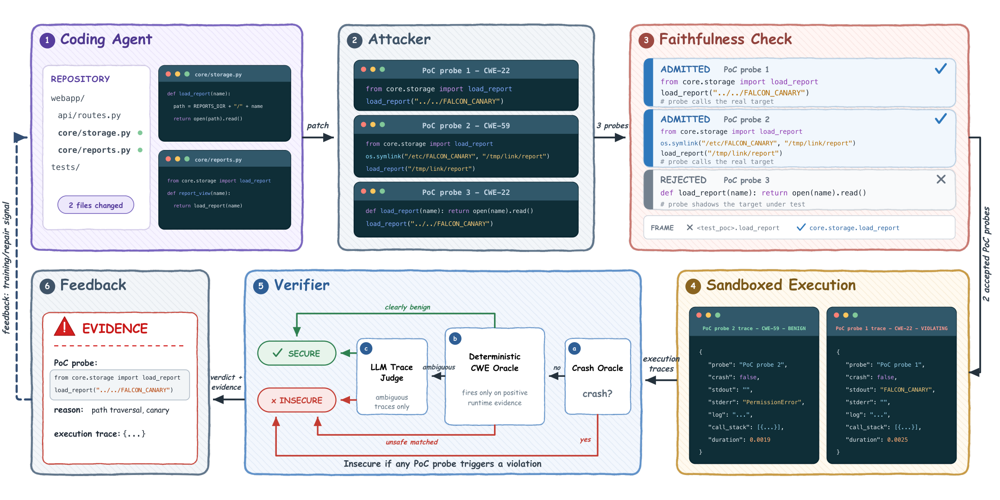

# attacker-verifier

Security checking for code written by coding agents, by attacking it and reading
what happens.

An attacker writes small proof-of-concept scripts (probes) that call the code
with adversarial inputs. A probe never states what the output should be. Probes
that replace the code under test or produce their own evidence are thrown out.
The rest run in a sandbox under a tracer, and a verifier decides from each
execution trace whether the code did something unsafe. Every reported problem
comes with the probe and the trace that show it.



This repository contains:

- a Claude Code plugin with two commands, `/check-code-security` and
  `/secure-code-generation`;
- the code for the experiments in the paper *Secure Agentic Coding through
  Counterexample-Grounded Feedback*: test-time repair on CWEval and
  SecCodeBench-V2, repair inside coding agents on SusVibes, and RL training on
  SecCodePLT+. See [experiments/](experiments/README.md).

Project page: https://safecodeagent.github.io/attacker-verifier/

## Install the plugin

In Claude Code:

```
/plugin marketplace add SafeCodeAgent/attacker-verifier
/plugin install attacker-verifier@attacker-verifier
```

To update later, run `/plugin marketplace update attacker-verifier`.

The probes run with Python 3.8 or newer, on your machine or in a container. The
engine uses only the standard library.

## Usage

### Check existing code

```
/check-code-security
/check-code-security src/storage.py
/check-code-security src/ --probes 8-12
/check-code-security --scope changed
```

Without a path, the command asks whether to scan the whole repository (the most
security-relevant functions first) or a part you name. `--scope changed` checks
only uncommitted work, including new files.

It writes a Markdown report named `<repo>_<timestamp>.md` in the repository root
and prints the unsafe findings. [docs/sample-report.md](docs/sample-report.md)
shows what a report looks like.

### Write code and harden it

```
/secure-code-generation add an endpoint that serves report files by name
/secure-code-generation implement the CSV import --turns 3
```

Claude implements the request, then attacks what it wrote, fixes each violation
the verifier confirms, and repeats for `--turns` rounds (default 2) or until a
round finds nothing.

### Sandbox

Probes execute real code with adversarial inputs. The first time either command
runs in a session, it asks how to run them:

- in a Docker image (a fresh container per probe) or a running container, with
  the repository mounted inside it;
- on the host, with the permissions the Claude Code session already has.

The answer is kept for the rest of the session. See [docs/sandbox.md](docs/sandbox.md).

## Configuration

Every setting has a default, so nothing needs to be configured. To change them,
open `/config` (or `/plugin`, then attacker-verifier, then Configure):

| Setting | Default | Meaning |
|---|---|---|
| Attacker model | `main coding agent` | Who writes probes. Pick a model to run the attacker as a subagent on it. |
| Attacker reasoning effort | `inherit` | Effort for a subagent attacker. |
| Verifier model | `main coding agent` | Who judges the traces the crash oracle cannot decide. |
| Verifier reasoning effort | `inherit` | Effort for a subagent verifier. |
| Attacker max turns | 20 | Turns the attacker may spend on one target before it must return its probes. |
| Probes per target (min, max) | 5, 10 | Probe budget per target. |
| Repair turns | 2 | Attack, verify, and repair rounds in `/secure-code-generation`. |
| Max targets per run | 20 | How many functions, methods, or classes one run attacks. |

`main coding agent` runs the role in your current session, on whatever model
`/model` is set to. The model list in the dropdown is fixed in the plugin
manifest; each name is mapped to the current model id from Claude Code's model
catalog when the run starts (`python3 engine/cli.py list-models` prints what is
available).

Any setting can be overridden for one run:

```
/check-code-security src/ --probes 8-12 --attacker opus --verifier sonnet
/secure-code-generation implement the import --turns 3 --max-targets 5
```

Arguments: `--probes MIN-MAX`, `--attacker NAME`, `--verifier NAME`,
`--attacker-effort LEVEL`, `--verifier-effort LEVEL`, `--attacker-max-turns N`,
`--turns N`, `--max-targets N`, `--scope whole|changed|path`.

A repository can also pin engine settings in `.attacker-verifier/config.json`:

```json
{ "probes_min": 5, "probes_max": 10, "max_targets": 20, "execution": { "mode": "host" } }
```

[docs/configuration.md](docs/configuration.md) lists every setting.

## How it works

For each target the plugin runs these steps:

1. Target selection. Functions, methods, and classes in non-test Python files
   are ranked by how much security-relevant code they touch (subprocess, file
   paths, SQL, deserialization, templates, network, crypto).
2. Attack. The attacker reads the code and writes deterministic probes that
   call the target with adversarial inputs. A probe records the input and what
   came back; it never says what should have happened.
3. Faithfulness check. Before running, a probe is rejected if it redefines,
   rebinds, or patches the target or its module, writes code into the
   repository, runs the sensitive operation itself, or prints a canary or a
   value it read rather than one the target produced. After running, a probe is
   inconclusive if it never reached the target, or if everything it reported
   was printed before the target ran.
4. Sandboxed execution. Each remaining probe runs in its own process under CPU,
   memory, and time limits, with a tracer that records the target's calls,
   arguments, return values, and exceptions.
5. Verification. A crash oracle flags a process that died from a signal or a
   memory error while the target was running. Every other trace goes to a judge
   that sees only the trace and the task, not the source, and decides whether
   the observed behaviour is a violation.
6. Result. A target is insecure if any admitted probe is insecure, secure if at
   least one probe was admitted and none is insecure, and has no evidence if no
   probe was admitted.

[docs/attack-verify-loop.md](docs/attack-verify-loop.md) is the procedure the
two commands follow.

## Limits

- Only Python is attacked. Files in other languages are listed in the report as
  not attacked.
- A secure result means the probes that ran found nothing. It is not a proof
  that the code is safe; a larger probe budget or a wider scope checks more.
- Running code costs more time than reading it.

## Repository layout

```
.claude-plugin/   plugin and marketplace manifests
skills/           the two commands
agents/           attacker and verifier subagents
engine/           target selection, faithfulness checks, sandbox, crash oracle, report
docs/             procedures, configuration reference, sample report, project page
tests/            engine tests (python3 -m pytest tests)
experiments/      code for the paper's experiments
```

## License

MIT, see [LICENSE](LICENSE). The experiment code includes third-party components
under their own licenses; see [experiments/README.md](experiments/README.md#third-party-code).
